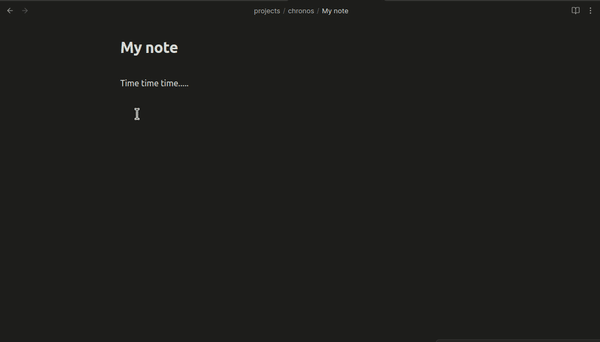
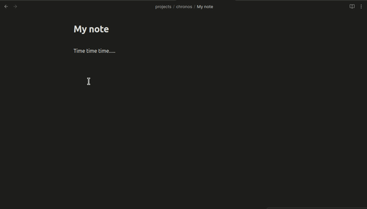

# Chronos Timeline: interactive timelines for Obsidian

Render interactive timelines in your Obsidian notes from simple markdown. Make sense of anything time related.

Powered by the [vis-timeline](https://www.npmjs.com/package/vis-timeline) library.



## Quickstart

Create timelines in your notes by opening a `chronos` codeblock and adding items

````markdown
```chronos
- [1789~1799] French Revolution
- [1791~1804] Haitian Revolution
- [1776] American Declaration of Independence
```
````


You can insert blank, basic, or advanced templates using the Command Pallete (`ctrl/cmd` + `p`, "Chronos")

### Insert blank


### Insert basic template



### Insert advanced template


### Cheatsheet

After installing the Chronos Timeline plugin, paste the contents of [this cheatsheet](./docs/chronos-cheatsheet.md) into a file in your vault to play with examples

## Contents

- [Chronos Timeline: interactive timelines for Obsidian](#chronos-timeline-interactive-timelines-for-obsidian)
  - [Quickstart](#quickstart)
    - [Insert blank](#insert-blank)
    - [Insert basic template](#insert-basic-template)
    - [Insert advanced template](#insert-advanced-template)
    - [Cheatsheet](#cheatsheet)
  - [Contents](#contents)
- [Syntax Overview](#syntax-overview)
  - [A note on dates](#a-note-on-dates)
    - [Date ranges](#date-ranges)
    - [BCE time](#bce-time)
  - [Events (`-`)](#events--)
    - [Events with a single date](#events-with-a-single-date)
    - [Events with start and end dates](#events-with-start-and-end-dates)
    - [Events with descriptions](#events-with-descriptions)
  - [Periods `@`](#periods-)
  - [Markers `=`](#markers-)
  - [Comments (`#`)](#comments-)
  - [Modifiers](#modifiers)
    - [Colors `#color`](#colors-color)
    - [Groups `{}`](#groups-)
  - [Advanced example](#advanced-example)
- [Actions](#actions)
  - [Edit](#edit)
  - [Refit](#refit)
- [Localization](#localization)
- [Generating timelines with AI](#generating-timelines-with-ai) - [Prompt template](#prompt-template)

# Syntax Overview

Chronos parses markdown in `chronos` code blocks into objects on a timeline

````markdown
```chronos
<chronos timeline items here>
```
````

The first character of each line in your `chronos` block determines the item type:

- [Events](#events--) (`-`)
- [Periods](#periods-) (`@`)
- [Markers](#markers-) (`=`)
- [Comments](#comments-) (`#`)

Certain items can be modified with colors and group membership (see [Modifiers](#modifiers))

## A note on dates

Chronos can visualize dates from the year down to the second level, using the syntax `YYYY-MM-DDThh:mm:ss`.

The only required component of a date is the year (`YYYY`). Beyond that, you can specify additional time granularity as needed for your use case.

If not explicitly provided:

- The month and day default to `01` (January and the 1st)
- The hour, minute, and second default to `00` (top of the hour or minute)

**Examples**

```
- [2020] A year
- [2020-02] A month
- [2020-02-28] A day
- [2020-02-28T12] An hour
- [2020-02-28T12:30] A minute
- [2020-02-28T12:30:09] A second
```


### Date ranges

Date ranges are separated by a tilde `~`, **NOT a hyphen**! Look out :)

The start and end date must be in chronological order.

```
- [2020~2024]
- [2024-02-28~2024-05-11]
- [2024-02-28T05:30~2024-02-28T08:30]
```

### BCE time

You can signify BCE times with the negtive symbol (-)

```
- [-10000]    <--- 10000 BCE
- [-550~-20]  <--- 550 ~ 20 BCE
- [-550~550]  <--- 550 BCE ~ 550 CE
```

## Events (`-`)

Events can include a single date or a date range.

### Events with a single date

**Syntax**

```
- [Date] Event Name
```

Only `[Date]` is required. If no `Event Name` is provided, the event title will default to the date or date range.

**Example**

````markdown
```chronos
- [1879-03-14] Einstein born
```
````


### Events with start and end dates

A date range is represented with a tilde (`~`) between the start and end dates.

**Syntax**

```
- [Date~Date] Event Name
```

**Example**

````markdown
```chronos
- [1991~2001] Time I believed in Santa
```
````


### Events with descriptions

You can add additional information to an event by adding a pipe `|` after the Event name. This text will appear in a popup when you hover over an event.

**Example**

````markdown
```chronos
- [1991~2001] Time I believed in Santa | ended when my brother tried to videotape Santa with a hidden camera
```
````


## Periods `@`

Periods are spans of time displayed with a semi-transparent background. **Periods must be a range with a start and end date**. `Period Name` is optional

```
@ [Date~Date] Period Name
```

**Example**

````markdown
```chronos
@ [-300~250] #red Yayoi Period
- [-100] Introduction of rice cultivation
- [-57] Japan’s first recorded contact with China

@ [250~538] Kofun Period
- [250] Construction of keyhole-shaped kofun burial mounds begins
- [369] Yamato state sends envoys to Korea
```
````


## Markers `=`

Markers can be used to highlight a key milestone in time. **Markers must be a single date**. `Marker Name` is optional

```
= [Date] Marker Name
```

**Example**

````markdown
```chronos
= [1440] Invention of the Gutenberg Press

- [1455] Gutenberg Bible Printed
@ [1501~1600] The Spread of Printing
- [1517] Martin Luther's 95 Theses
```
````


## Comments (`#`)

Chronos will ignore any line that starts with `#`. You can use this to write comments to yourself or block out items.

**Example**

````markdown
```chronos
# this line is a comment, it will be ignored by chronos

- [1789~1799] French Revolution
- [1791~1804] Haitian Revolution
- [1776] American Declaration of Independence

# the event below will not render, since it has been commented out
# - [1939~1945] World War II
```
````


## Modifiers

Modifiers **#color** and **{Group}** can be added to **Events** (`-`) and **Periods** (`@`) with the following optional syntax.

```
- [Date-Date] #color {Group Name} Name | Description
```

The modifiers must go in this order: between `Dates` and `Name`, with color first if both color and group are used.

### Colors `#color`

By default, Chronos matches your Obsidian theme color.

To give items a specific color, you can include an available color after the date: `#red` | `#orange` | `#yellow` | `#green` | `#blue` | `purple` | `#pink` | `#cyan`

**Example**

````markdown
```chronos
- [2001~2009] #red Bush
- [2009~2017] #blue Obama
- [2017~2021] #red Trump
- [2021~2025] #blue Biden

@ [2020-03-11~2023-05-11] #pink COVID19
```
````


### Groups `{}`

**Events** and **Periods** can be grouped into "swimlanes" by specifying a `Group Name` in curly brackets `{}` after the `Date` (or `Color`, if present). Group names are case sensitive and may contain spaces.

The order of items does not matter, but the example below lumps items together by group for human legibility.

**Example**

````markdown
```chronos
@ [1892-10-08~1941-08-31]{Marina Tsvetaeva} 1892-1941
- [1916] {Marina Tsvetaeva} "Подруга"
- [1928] {Marina Tsvetaeva}  "Поэма концов"
- [1941] {Marina Tsvetaeva} "Записки о поэзии"

@[1899-08-24~1986-06-14]{Jorge Luis Borges} 1899-1986
- [1944] {Jorge Luis Borges} "Ficciones"
- [1949] {Jorge Luis Borges} "El Aleph"
- [1962] {Jorge Luis Borges} "Labyrinths"
```
````


## Advanced example

This example combines **Events**, **Periods**, **Markers**, **Comments**, **Descriptions**, **Groups** and **Colors**

````markdown
```chronos
- [1945-07-17] {Europe} Potsdam Conference | where post-WWII Europe is divided
- [1947-03-12] {USA} Truman Doctrine | committing the U.S. to containing communism
- [1948-06-24~1949-05-12] {Europe} Berlin Blockade | and Airlift in response to Soviet actions in Berlin
- [1949-04-04] {Europe} Formation of NATO

# Early Cold War

@ [1957~1969] #cyan {USSR} Space Race
@ [1957~1969] #cyan {USA} Space Race
- [1950-06-25~1953-07-27] {Asia} Korean War | between North and South Korea
- [1955-05-14] {USSR} Warsaw Pact | in response to NATO
- [1957-10-04] #cyan {USSR} Sputnik launched | initiating the Space Race
- [1961-04-17] {Cuba} Bay of Pigs Invasion | in Cuba

# Height of Tensions

- [1962-10-16] {Cuba} Cuban Missile Crisis | a peak confrontation between the U.S. and USSR
- [1963-08-05] {Global} Partial Nuclear Test Ban Treaty signed
- [1969-07-20] #cyan {USA} Apollo 11 Moon landing | U.S. wins the Space Race
- [1972-05-26] {Global} SALT I signed | first Strategic Arms Limitation Treaty

# Détente Period

- [1979-12-24~1989-02-15] {USSR} Soviet-Afghan War | straining Soviet resources
- [1983-03-23] {USA} Reagan announces the Strategic Defense Initiative (SDI)
- [1986-04-26] {USSR} Chernobyl nuclear disaster
- [1987-12-08] {Global} INF Treaty | signed, eliminating intermediate-range nuclear missiles

# Late Cold War

- [1989-11-09] {Europe} Fall of the Berlin Wall | symbolizing the end of Cold War tensions
- [1991-07-31] {Global} START I Treaty signed | further arms reduction
- [1991-12-26] {USSR} Dissolution of the Soviet Union | officially ending the Cold War

= [1991-12-26] End of the Cold War

```
````


# Actions

## Edit

To enter **Edit** mode an update your `chronos` markdown, hover over the timeline and click the code icon that appears in the upper-right corner.


## Refit

Click the **Refit** button (crosshairs icon) in the lower-right corner to adjust all items to fit within the view window.


# Localization

You can choose your preferred language for event date tooltips, from the Chronos Timeline plugin settings.

Available options depend on your system's language settings.


# Generating timelines with AI

_In the future this may be added as a feature directly in the plugin._

LLMs like [ChatGPT](https://chatgpt.com/) are good at generating Chronos timelines in one shot. Just paste your information in the placeholder `<YOUR REQUEST HERE>` and ask AI.

**Example requests:**

- "Industrial Revolution"
- "Industrial Revolution, with groups for different regions of the world"
- "The life and works of Jorge Luis Borges"
- _some text with time data to convert to Chronos_

### Prompt template

````markdown
Generate timelines in markdown using Chronos syntax, a simple line-by-line format for creating events, periods, and markers.

### Syntax Overview:

1. **Events**: `- [Date~Date] Event Name | Description`

   - The second Date, Event Name, and Description are optional.

2. **Periods**: `@ [Date~Date] Period Name`

   - Requires both start and end Dates. Period Name is optional.
   - Periods do NOT have descriptions.

3. **Markers**: `= [Date] Marker Name`
   - Requires a single Date.

### Rules:

- Important: the items should be wrapped in a codeblock with language "chronos"
- Important: keep Period Names and Event Names as brief as possible
- **Date format**: `YYYY-MM-DDThh:mm:ss`, with minimum granularity required (e.g., just year).
- Use `#` at the start of a line to add ignored comments.
- Events and Periods support optional modifiers:
  - **Colors**: e.g., `$red, #blue`.
  - **Groups**: `{Group Name}` (case-sensitive, can include spaces).
- Possible colors: $red, #orange, #yellow, #green, #blue, #purple, #pink, #cyan
- BCE Dates: Represented with `-` (e.g., `-10000` for 10000 BCE).
- Periods can use colors to differentiate overlapping or sequential periods.
- Focus on simplicity; not all item types need to be used.

### Example:

```chronos
- [1947-03-12] Truman Doctrine | Committing the U.S. to containing communism
- [1948-06-24~1949-05-12] Berlin Blockade | Soviet blockade and Allied airlift
@ [1947-01-01~1953-12-31] Early Cold War
- [1957-10-04] Sputnik launched | Start of the Space Race
@ [1963-01-01~1979-12-31] #red Détente Period
= [1991-12-26] End of the Cold War
```

Using Chronos syntax, generate markdown for a timeline of the following:

<YOUR REQUEST HERE>
````
